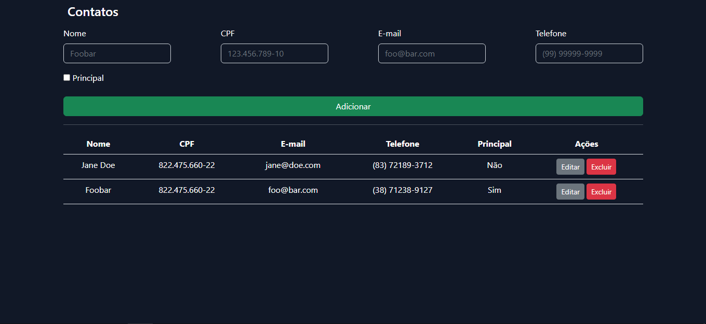

Para testar a aplicação, clone o repositorio em algum diretorio
git clone https://github.com/jrafael29/projeto_pratico.git

Acesse o diretorio da aplicação

- Crie uma copia do arquivo .env.example e renomeie para .env
- Configure as credenciais do seu banco de dados MYSQL, e as variaveis de ambiente que achar importante.
- Logo após, gere uma chave para a aplicação com o comando "php artisan key:generate"
- Instale as dependencias com o comando "composer install"
- Rode as migrations com o comando "php artisan migrate"
- Após isso, pode subir o servidor localmente, usando o comando "php artisan serve"

<h1> Single Page Application Interface </h1> 
 

<h2> Editar Contato </h2>
 
